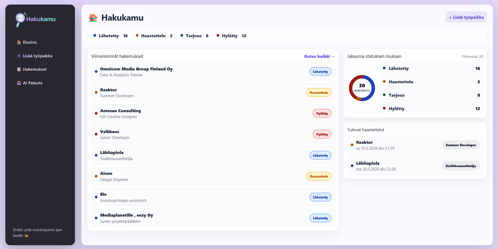
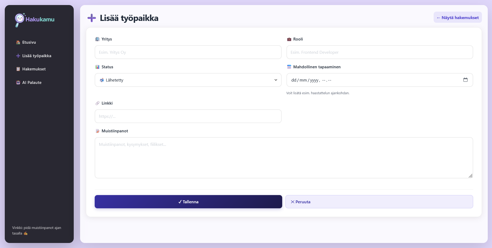
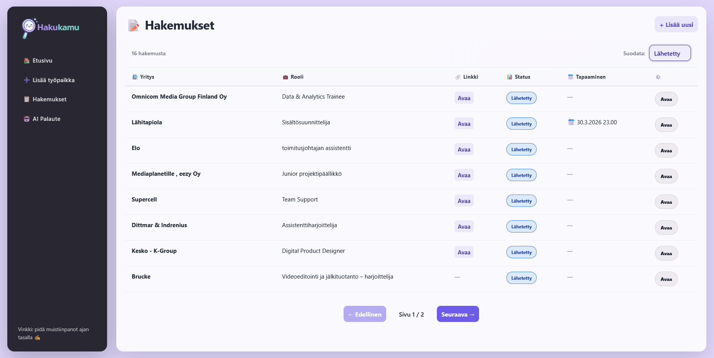
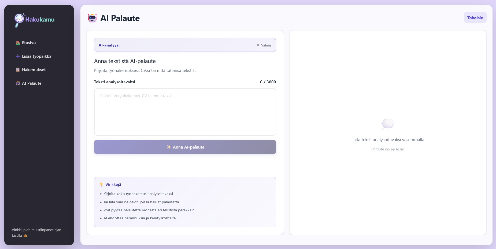

# Hakukamu

Hakukamu is a simple application for managing job applications. It allows users to store and track the job applications they have sent and monitor their status during the recruitment process.

## Purpose of the Project

The purpose of this project is to practice full stack web development by building a working web application for tracking job applications.

## Features

* Add a new job application
* Track the status of applications
* Save notes about job applications
* Link the job posting to the application
* Simple database structure

## Tech Stack

* **Node.js**
* **SQLite**
* **Drizzle ORM**
* **TypeScript**

## Database

The application uses an SQLite database.

### Tables

#### user

Stores user information.

| Column | Type | Description |
|------|------|------|
| id | text | Unique user ID |
| age | integer | User age (optional) |

#### job_application

Stores the user's job applications.

| Column | Type | Description |
|------|------|------|
| id | integer | Application ID |
| company | text | Company name |
| role | text | Job role applied for |
| status | text | Application status |
| notes | text | Notes |
| url | text | Link to the job posting |

### Status values

Applications can have the following statuses:

* `LAHETETTY`
* `KASITTELYSSA`
* `HAASTATTELU`
* `TARJOUS`
* `HYLATTY`

## Installation

1. Clone the repository

git clone https://github.com/NoonaJessica/Hakukamu.git

2. Move into the project directory

cd Hakukamu

3. Install dependencies

npm install

4. Start the project

npm run dev

## Database Setup

The application uses Drizzle ORM for database management and migrations.

### Running migrations

Migrations are run automatically when the application starts. You can also run them manually:

npm run db:push

### Generating migrations

If you make changes to the `schema.ts` file, generate a new migration:

npm run db:migrate

### Viewing the database

You can inspect and manage the database using Drizzle Studio:

npm run db:studio

This opens a browser where you can view tables, add data, or edit records.

### Resetting the database

To delete and recreate the database:

npm run db:reset

**Warning:** This will delete all data in the database.

## Project Structure

Hakukamu
│
├── db
│ └── schema.ts
│
├── src
│ └── application logic
│
└── README.md

## Future Improvements

Possible improvements:

* user-specific applications (`userId`)
* timestamps for applications (`created_at`, `updated_at`)
* job application analytics

## Screenshots

